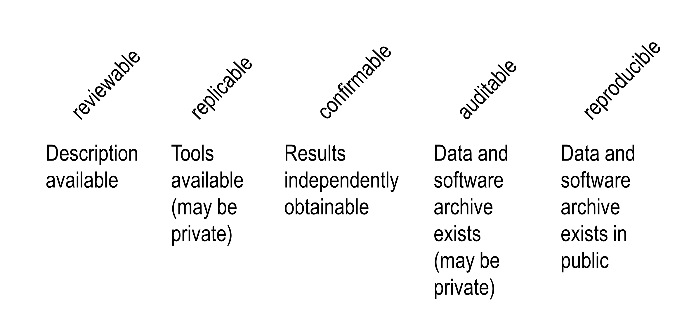
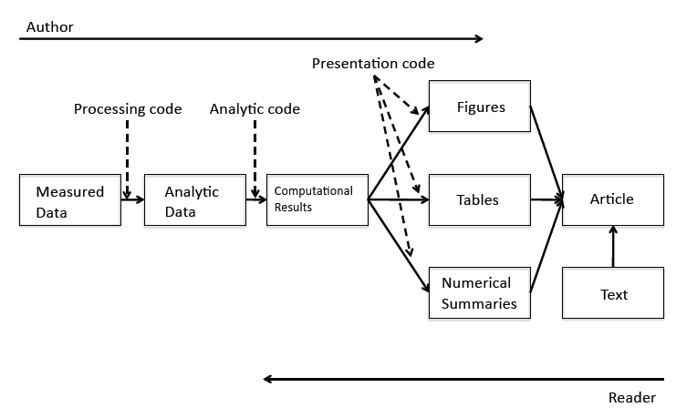
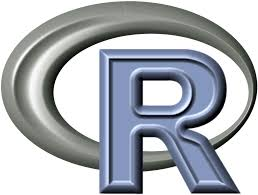
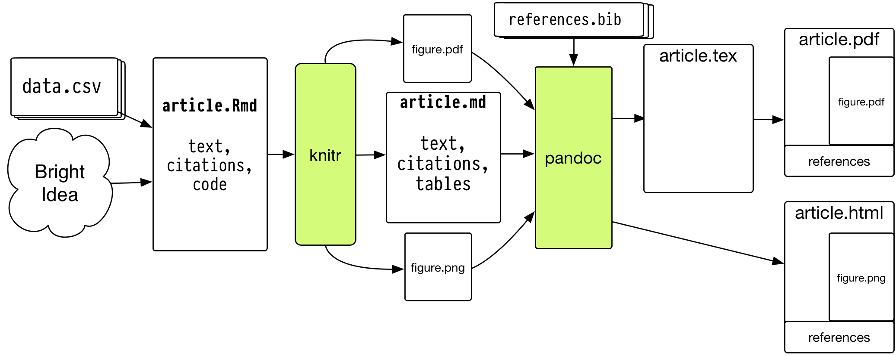
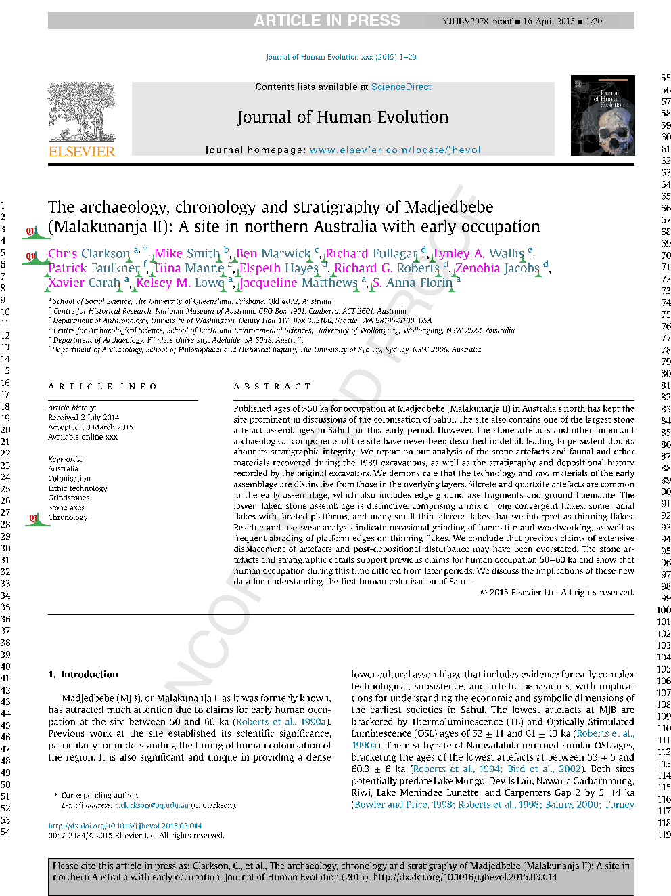
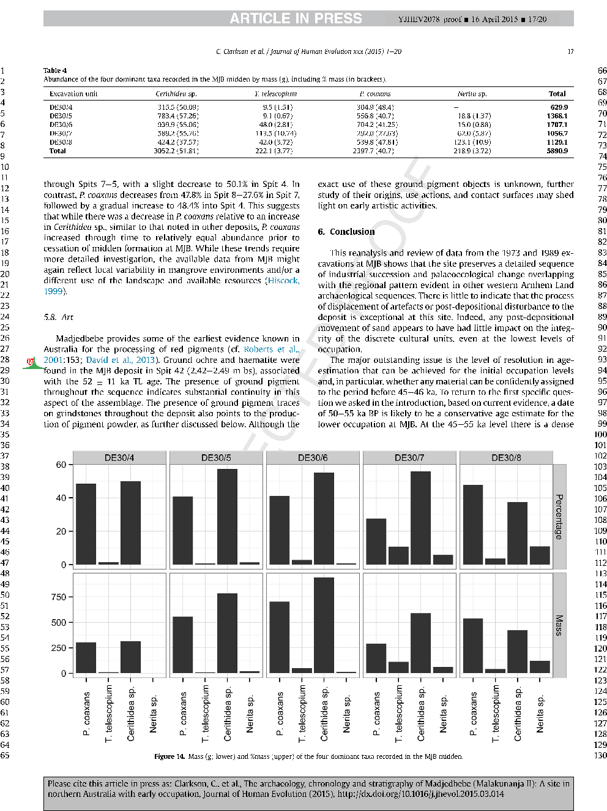
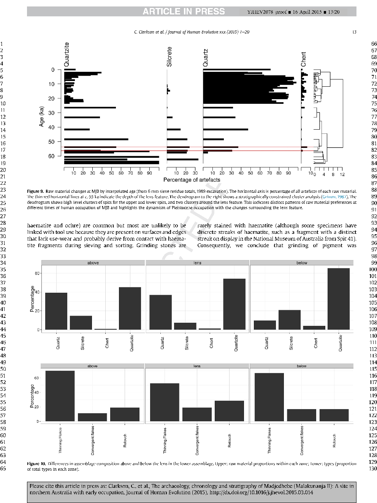
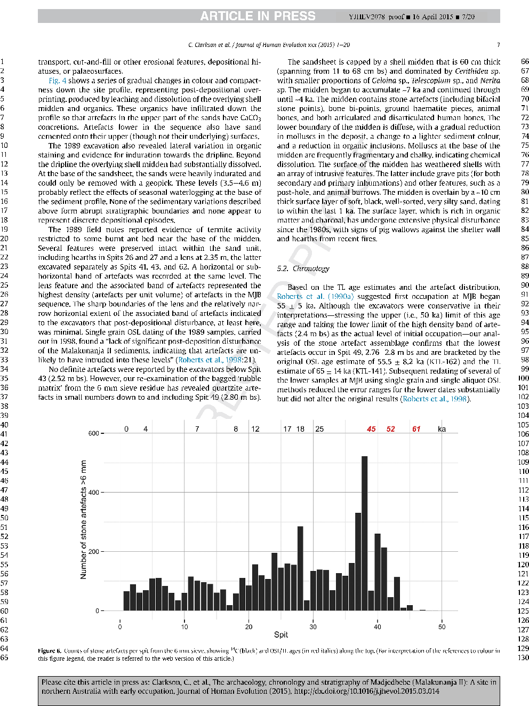
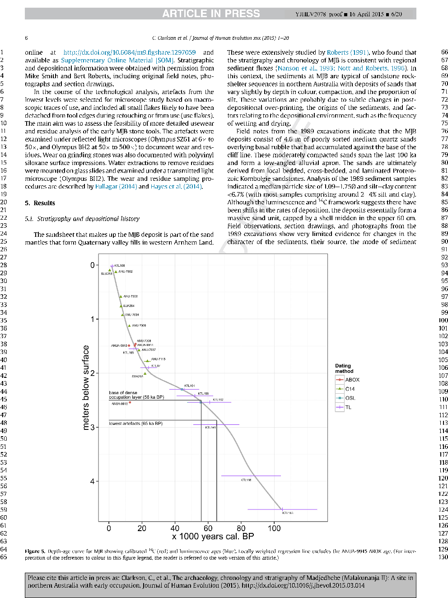
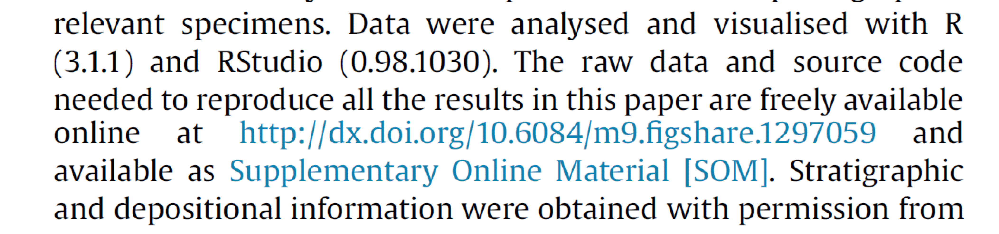

Reproducible research in archaeology: Basic principles and common tools
========================================================
author: Ben Marwick, University of Washington
date: Society of American Archaeology Meeting, April 2015
transition: none

Definitions are in flux
========================================================

Computational - Statistical - Empirical

Stodden, V., et al. 2013. "Setting the default to reproducible." computational science research. SIAM News 46: 4-6.

Motivations: Claerbout's principle
========================================================

>"An article about a computational result is **advertising**, not scholarship. The actual scholarship is the full software environment, code and data, that produced the result." <small><small>- Claerbout and Karrenbach, Proceedings of the 62nd Annual International Meeting of the Society of Exploration Geophysics. 1992</small></small>

Claerbout's principle in detail
========================================================

>"When we publish articles containing figures which were generated by computer, we also publish the **complete software environment** which generates the figures" <small><small>- Buckheit & Donoho, Wavelab and Reproducible Research, 1995.</small></small>

>"The **scholarship** does not only consist of theorems and proofs but also (and perhaps even more important) of data, computer code and a runtime environment which provides readers with the possibility to **reproduce all tables and figures in an article**." <small><small>- Hothorn et al., 2009 Case studies in reproducibility</small></small>

Goal is to expose the reader to more of the research workflow
=======================================================

<small><small><small>http://www.stodden.net/AMP2011/slides/pengslides.pdf</small></small></small>

Current workflow in archaeology & many other disciplines
========================================================
`
`
- Enter data in spreadsheet/database
- Use Excel for data cleaning & descriptive statistics
- Import data into SPSS/SAS/Stata for further analysis
- Use point-and-click options to run statistical analyses
- Copy & paste output to Word document, repeatedly

***

My workflow & tools
========================================================
Using literate statistical programming

Using an [open source programming language](http://www.r-project.org/) &  [open document formatting language](http://rmarkdown.rstudio.com/)

Using [version control](http://git-scm.com/) & [continuous integration](http;??www.travis-ci.org)

Using [dynamic documents](http://yihui.name/knitr/)

Using an [isolated environment](http://www.docker.com)

Using [permissive licenses](http://opensource.org/licenses/MIT) & [permanent URLs](http://figshare.com)

***
             
-------------- ----------- --------------
    

A case study: An executable article
========================================================

 
 
 
 

We must integrate these values into everyday tasks
========================================================
- **Train students** by putting homework, assignments & dissertations on the reproducible research spectrum
- **Publish examples** of reproducible research in our field
- **Request** code & data when reviewing
- **Submit to & review for journals** that support reproducible research
- Critically review & audit **data management plans** in grant proposals
- Consider reproducibility wherever possible in **hiring, promotion & reference letters**.

========================================================
>"Abandoning the habit of secrecy in favor of process transparency and peer review was the crucial step by which alchemy became chemistry."
---
<small><small>-Raymond, E. S., 2004, The art of UNIX programming: Addison-Wesley.</small></small>

Colophon
========================================================
Presentation written in [Markdown](http://daringfireball.net/projects/markdown/) ([R Presentation](http://www.rstudio.com/ide/docs/presentations/overview))

Compiled into HTML5 using [RStudio](http://www.rstudio.com/ide/)

Source code hosting: https://github.com/benmarwick/

ORCID: http://orcid.org/0000-0001-7879-4531

Licensing: 

* Presentation: [CC-BY-3.0 ](http://creativecommons.org/licenses/by/3.0/us/)

* Source code: [MIT](http://opensource.org/licenses/MIT) 

